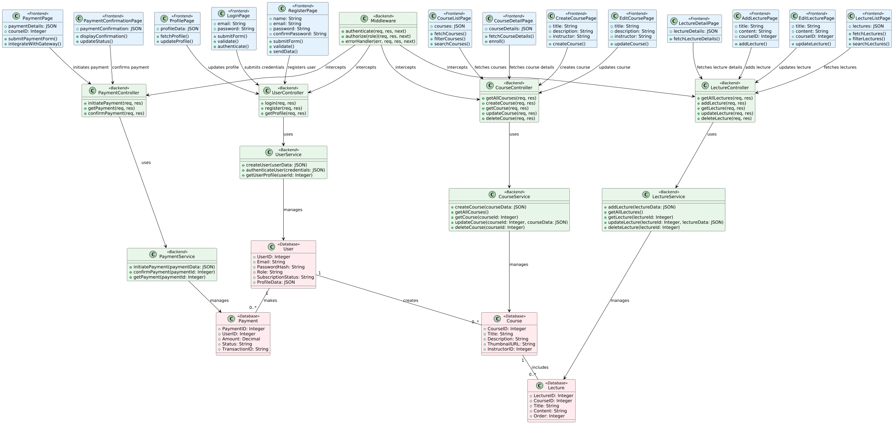

# LMS(Learning Management System )


## Table of Contents

- [Overview](#overview)
- [Features](#features)
- [Installation](#installation)
- [Subscription Management](#subscription-management)
- [Prerequisites](#prerequisites)
- [Contributing](#contributing)
- [Further-Support](#further-support)

## Overview

The Learning Management System (LMS) is a web-based application that facilitates the management and delivery of educational content and training materials. It allows administrators to create courses, manage users, and track progress. Users can access courses, view content, and complete assessments. Additionally, it offers subscription management through Razorpay, allowing users to purchase and cancel subscriptions.

## Features

- User authentication and authorization (using JWT)
- Course creation, modification, and deletion
- Content upload and management via Cloudinary
- User enrollment in courses and progress tracking
- Interactive user interface using React and Tailwind CSS
- Subscription management with Razorpay (for premium content)


```

## Low Level Diagram


## Prerequisites

Before running this project locally, ensure you have the following installed:

- [Node.js](https://nodejs.org/) (v14.x or higher)
- [npm](https://www.npmjs.com/) (v6.x or higher)
- [MongoDB](https://www.mongodb.com/) (v4.x or higher)
- [Cloudinary](https://cloudinary.com/) account and API credentials
- [Razorpay](https://razorpay.com/) account and API credentials

